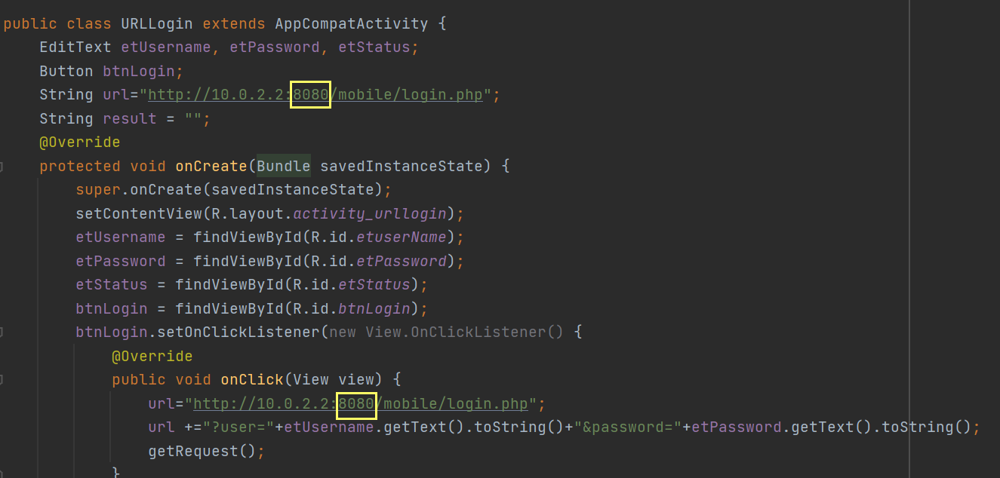
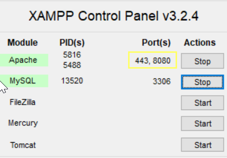

# Read Me

### Table of Contents

- [Technologies](#technologies)
- [How To Use](#how-to-use)

---

## Technologies

- phpmyadmin
- Android Studio
- Android API 30
- xampp

[Back To The Top](#read-me)

---

## How To Use

> Pindahin folder "mobile" ke xampp/htdocs

> Buka xammp, jalanin apache & MySQL

> Buka phpmyadmin > Buat Database baru dengan nama "mobile" > Buat tabel "users" dengan kolom "id", "username", "password"

>Pada file URLLOGIN.java & Database.java, pastikan port pada String url sama dengan Apache port di xampp
>>Apache port di xampp\

>>Port di URL\

---

## References
[Tutorial Android Komunikasi dengan Server menggunakan Http](http://agusharyanto.net/wordpress/?p=452)

---

